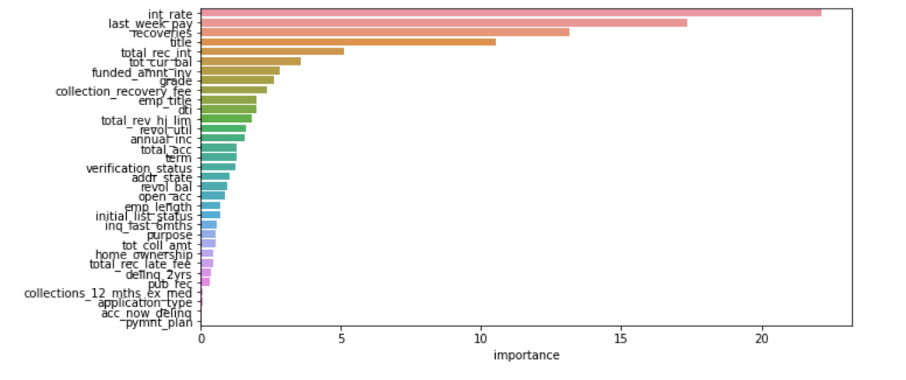

# Loan_Status_Classification

## Problem Statement
The Bank Indessa has not done well in the last 3 quarters. Their NPAs (Non Performing Assets) have reached all time high. It is starting to lose the confidence of its investors. As a result, it’s stock has fallen by 20% in the previous quarter alone.
After careful analysis, it was found that the majority of NPA was contributed by loan defaulters. With the messy data collected over all the years, this bank has decided to use machine learning to figure out a way to find these defaulters and devise a plan to reduce them.
This bank uses a pool of investors to sanction their loans. For example: If any customer has applied for a loan of $20000, along with the bank, the investors perform due diligence on the requested loan application. Keep this in mind while understanding data.

Evaluation Metric
AUC-ROC score - 

Data information - For Data information you can go through - Data Understanding Excel sheet.

Univariate Analysis - For univariate analysis you can go through - Univariate_train_indess sheet. 

Bivariate Analysis - For Bivariate Analysis you can go through - Data Analysis Jupyter notebook file. 

### For overall analysis you can go through SWEETVIZ_REPORT.html file - Automated visualization 

For Data prepration and modelling part you can go through - Data Prep and modelling Jupyter notebook. 

- This task is based on calssification problem ( Imbalanced Target - 0 - 76% and 1- 23% aprox ). 
- Here are the submission of best 2 models that is - CatBoost Classifier and LightGBM.  
- Comparision of ROC AUC score - 

- Feature Importance - 

- Both the models works well. 
- there are 2 submission file - use - "catboost_submission.csv" 
- The prediction is based on probability scores - loan_amount > 0.5 is Defaulter(1) and loan_amount < 0.5 is Non Defaulters(0).

